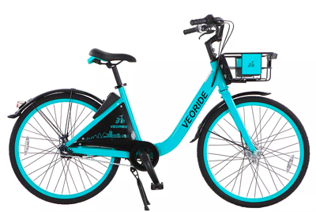
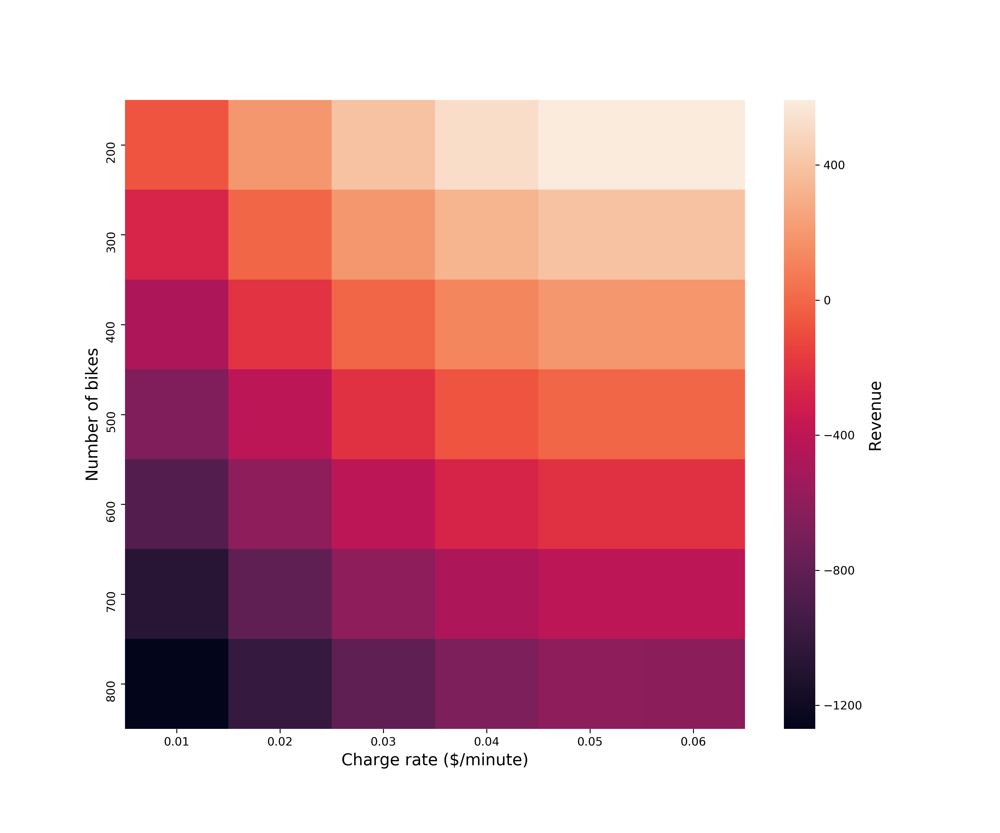
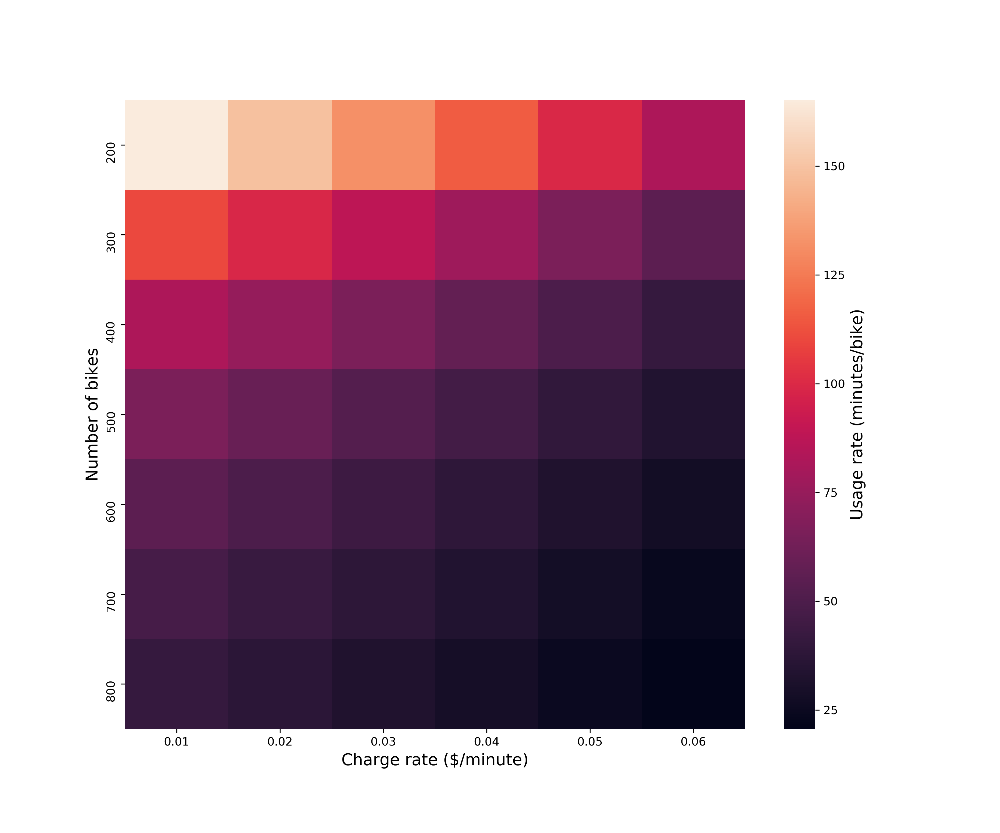

# 590PR Final_Project

# Title: Shared Bicycle Monte Carlo Simulation


## Team Member(s):
- Jifu Zhao (jzhao59): 
    * Choose and make assumptions for the variables. 
    * Choose and write the algorithm for riding the bicycle. 
    * Improve the distribution of variables. 
    * Improve the visualization of the simulation into heatmap.
- Yunya Gu (yunyagu2): 
    * Choose and make assumptions for the variables. 
    * Make simple visualization. 
    * Add more scenarios and adjust algorithm. 
    * Combine, test and add docstrings for code.
- Bo Zhao (boz5): 
    * Do research on VeoRide. 
    * Improve assumptions for variables. 
    * Simulate the distribution of number of students who are willing to take the ride and whether the willing students can get bicycles immediately. 
    * Make the PPT for presentation.

# Monte Carlo Simulation Scenario & Purpose:
Recently, shared bicycles have been widely deployed in campus. For example, UIUC recently has a new shared bicycles program with [VeoRide](https://www.veoride.com/). The shared bicycle provides cheap and convenient ways for students to travel around the campus. For shared bicycles, it's important to design the management strategy such that the cost can be minimized and the profit is maximized. Two most important factors are number of bicycles and the charge rate for students.

In this study, the authors want to study the best number of bicycles and charge rate for shared bicycles. Since there are some uncertainties, one way is to use the Monte Carlo simulation. Thus, under certain assumptions, this study analyzes the influence of number of bicycles and charge rate on the profit of shared bicycle program.

## Simulation's variables of uncertainty
List and describe your simulation's variables of uncertainty (where you're using pseudo-random number generation). For each such variable, how did you decide the range and probability distribution to use?  Do you think it's a good representation of reality?
- Number of students who are willing to take the ride: Poisson distribution with given expectation
    - the expectation should be inversely related to charge rate
- Duration of the trip
    - typically between 5 minutes and 30 minutes
- Whether or not the willing students can get bicycles immediately
    - Bernoulli distribution with p

## Other variables
- Assume there are 50,000 students in total
- Number of bicycles: 200, 300, 400, 500, 600, 700, 800
- Charge rate: $0.02/min, $0.03/min, $0.04/min, $0.05/min, $0.06/min
- Percentage of students who are willing to take the bicycle: 0.1%, 0.09%, 0.08%, 0.07%, 0.06%, 0.05%

## Hypothesis or hypotheses before running the simulation:
- We can find the best combination of number of bicycles and charge rate to maximize the profit
    - Cost for bicycles is fixed number per bicycle per day
    - Don't consider other uncertainties such as weather effects

## Analytical Summary of your findings: (e.g. Did you adjust the scenario based on previous simulation outcomes?  What are the management decisions one could make from your simulation's output, etc.)

Through Monte Carlo simulations, we identify the influence of number of bikes and charge rate on daily revenue and bike's usage, which is shown below.





## Instructions on how to use the program:

#### Prerequisite:
Numpy, Pandas, Seaborn, Matplotlib

#### To repeat the results:
```console
test@macbook:~$ python main.py
```
The corresponding csv file and corresponding figures are saved in the same path.

#### Or you can call the module separately:
```Python
from bicycle import Bicycle
bike = Bicycle(num_bike=100, rate=0.05, seed=None)
bike.simulate()
```

## All Sources Used:
- https://www.veoride.com/
